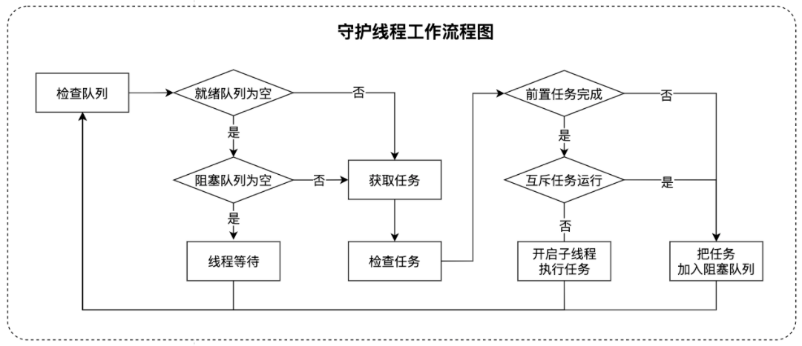

## 测试案例调度系统

### 目录
1. 介绍
2. 系统设计
3. 项目结构
4. 技术选型
5. 部署

### 一、介绍
测试案例调度系统（Test case scheduling system，简称TCSS），提供了一套针对大批量的测试用例，能够实现高效分批执行的用例执行方案。

TCSS的目标是解决以下三个问题：
* 分布式执行测试案例
* 部分案例可以不同时执行
* 部分案例可以按顺序执行

比如，公司每天需要批量评测1万条测试案例，你可以分5台机器，每台机器执行2000条，但是里面有一些案例可能不能同时执行，程序要怎么解决这个问题（TCSS）

### 二、系统设计



### 三、项目结构

```
tcss
|__tcss-common -- 通用代码及工具类
|__tcss-backend -- 后台服务模块
|__tcss-tester -- 测试服务模块
```

### 四、技术选型

| 技术 | 说明 | 官网 |
| --- | --- | --- |
| Spring Boot | 容器框架 | |
| Redis | 缓存 | |
| MySQL | 数据库 | |
| Nacos | 注册、配置中心 | |

### 五、数据库设计

* 测试案例表（test_case）

| 字段名称 | 字段类型 | 键 | 备战 |
| --- | --- | --- | --- |
| id | Long | 主键 | 案例编号 |
| title | String | | 案例名称 |
| url | String | | 案例地址 |
| input | String | | 案例输入 |
| output | String | | 案例输出 |
| case_status | String | | 案例状态 |
| case_type | String | | 案例类型 |
| case_pre | Long | 外键 | 前置案例 |
| gmt_create | Date | | 创建时间 |
| gmt_modified | Date | | 修改时间 |
| isDelete | Short | | 是否删除 |
